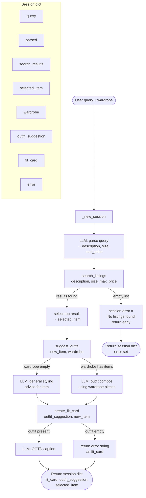

# FitFindr — planning.md

> Complete this document before writing any implementation code.
> Your spec and agent diagram are what you'll use to direct AI tools (Claude, Copilot, etc.) to generate your implementation — the more specific they are, the more useful the generated code will be.
> Your planning.md will be reviewed as part of your submission.
> Update it before starting any stretch features.

---

## Tools

List every tool your agent will use. For each tool, fill in all four fields.
You must have at least 3 tools. The three required tools are listed — add any additional tools below them.

### Tool 1: search_listings

**What it does:**

<!-- Describe what this tool does in 1–2 sentences -->

Searches the mock listings dataset for items that match the user's description, optional size, and optional price ceiling. Returns a ranked list of matching listing dicts sorted by keyword relevance.

**Input parameters:**

<!-- List each parameter, its type, and what it represents -->

- `description` (str): Keywords describing what the user is looking for (e.g., "vintage graphic tee").
- `size` (str | None): Size string to filter by, or `None` to skip size filtering. Matching is case-insensitive.
- `max_price` (float | None): Maximum price (inclusive), or `None` to skip price filtering.

**What it returns:**

<!-- Describe the return value — what fields does a result contain? -->

A list of matching listing dicts sorted by relevance score (highest first). Each dict has fields: `id`, `title`, `description`, `category`, `style_tags`, `size`, `condition`, `price`, `colors`, `brand`, `platform`. Returns an empty list if nothing matches.

**What happens if it fails or returns nothing:**

<!-- What should the agent do if no listings match? -->

Returns an empty list — does not raise an exception. The agent checks for an empty result after calling this tool and sets `session["error"]` with a helpful message before returning early.

---

### Tool 2: suggest_outfit

**What it does:**

Given a thrifted item the user is considering and their existing wardrobe, this tool calls an LLM (via Groq) to suggest 1–2 complete outfits by pairing the new item with pieces the user already owns.

**Input parameters:**

- `new_item` (dict): A listing dict for the item the user is considering (fields: id, title, description, category, style_tags, size, condition, price, colors, brand, platform).
- `wardrobe` (dict): A wardrobe dict with an `items` key containing a list of wardrobe item dicts. May be empty.

**What it returns:**

A non-empty string with 1–2 outfit suggestions written in natural language. If the wardrobe is empty, the string contains general styling advice for the new item (what types of pieces pair well, what vibe it suits, etc.).

**What happens if it fails or returns nothing:**

If the wardrobe is empty, the agent does not stop — it falls back to general LLM styling advice instead of specific combinations. If the LLM call itself fails, the agent sets `session["error"]` to a descriptive message and returns early without calling `create_fit_card`.

---

### Tool 3: create_fit_card

**What it does:**

Takes the outfit suggestion string and the listing dict for the thrifted item and asks an LLM to generate a 2–4 sentence casual caption suitable for an Instagram/TikTok OOTD post.

**Input parameters:**

- `outfit` (str): The outfit suggestion string returned by `suggest_outfit`.
- `new_item` (dict): The listing dict for the thrifted item (provides title, price, platform, style tags, etc.).

**What it returns:**

A 2–4 sentence string written in a casual, authentic OOTD tone that naturally mentions the item name, price, and platform once each and captures the outfit vibe in specific terms.

**What happens if it fails or returns nothing:**

If `outfit` is empty or whitespace-only, the function returns a descriptive error string (does NOT raise an exception). The agent surfaces this string to the user as an explanation rather than crashing.

---

### Additional Tools (if any)

<!-- Copy the block above for any tools beyond the required three -->

---

## Planning Loop

**How does your agent decide which tool to call next?**

The planning loop runs top-to-bottom with one early-exit point after `search_listings`. Every step stores its output in the session dict before proceeding.

**Step 1 — Parse the query.**
Call the LLM with the raw `session["query"]` and ask it to return a JSON object with three fields: `description` (str), `size` (str or null), `max_price` (float or null). Store the parsed result in `session["parsed"]`. If the LLM returns something unparseable, set `session["error"] = "Could not parse your query."` and return the session early.

**Step 2 — Search listings.**
Call `search_listings(description=parsed["description"], size=parsed["size"], max_price=parsed["max_price"])` and store the result in `session["search_results"]`.
- If `search_results` is empty: set `session["error"] = "No listings found matching your search. Try a broader description or a higher price limit."` and return the session immediately. Do not proceed to `suggest_outfit`.
- If `search_results` is non-empty: set `session["selected_item"] = session["search_results"][0]` and continue.

**Step 3 — Suggest an outfit.**
Call `suggest_outfit(new_item=session["selected_item"], wardrobe=session["wardrobe"])` and store the result in `session["outfit_suggestion"]`.
- This tool never raises — it falls back to general advice when the wardrobe is empty — so no branch is needed here. Always continue.

**Step 4 — Create the fit card.**
Call `create_fit_card(outfit=session["outfit_suggestion"], new_item=session["selected_item"])` and store the result in `session["fit_card"]`.
- This tool also never raises — it returns an error string on bad input — so no branch is needed. Always continue.

**Step 5 — Return.**
Return the session dict. At this point `session["error"]` is `None`, `session["fit_card"]` is a non-empty string, and `session["outfit_suggestion"]` is a non-empty string.

---

## State Management

**How does information from one tool get passed to the next?**

All state lives in a single `session` dict initialized by `_new_session(query, wardrobe)` at the start of every run. The fields are:

| Field | Set by | Used by |
|---|---|---|
| `query` | caller | LLM parser (step 2) |
| `parsed` | LLM parser | `search_listings` (step 3) |
| `search_results` | `search_listings` | agent (selects top item) |
| `selected_item` | agent | `suggest_outfit`, `create_fit_card` |
| `wardrobe` | caller | `suggest_outfit` |
| `outfit_suggestion` | `suggest_outfit` | `create_fit_card` |
| `fit_card` | `create_fit_card` | returned to UI |
| `error` | agent (on failure) | caller/UI |

Each tool receives its inputs as explicit function arguments (not the whole session dict), keeping tools independently testable. The agent extracts values from the session, calls the tool, and writes the result back into the session.

---

## Error Handling

For each tool, describe the specific failure mode you're handling and what the agent does in response.

| Tool            | Failure mode                          | Agent response |
| --------------- | ------------------------------------- | -------------- |
| search_listings | No results match the query            | Agent sets `session["error"]` to "No listings found matching your search. Try a broader description or higher price limit." and returns the session early — `suggest_outfit` and `create_fit_card` are never called. |
| suggest_outfit  | Wardrobe is empty                     | Tool falls back to a general LLM styling prompt ("what kinds of pieces pair well with this item") instead of referencing specific wardrobe pieces. Returns a non-empty string; no early exit. |
| create_fit_card | Outfit input is missing or incomplete | Tool returns a descriptive error string (e.g., "Could not generate a fit card: outfit description was empty.") without raising an exception. Agent surfaces this string as `session["fit_card"]`. |

---

## Architecture

---

## AI Tool Plan

<!-- For each part of the implementation below, describe:
     - Which AI tool you plan to use (Claude, Copilot, ChatGPT, etc.)
     - What you'll give it as input (which sections of this planning.md, your agent diagram)
     - What you expect it to produce
     - How you'll verify the output matches your spec before moving on

     "I'll use AI to help me code" is not a plan.
     "I'll give Claude my Tool 1 spec (inputs, return value, failure mode) and ask it to implement
     search_listings() using load_listings() from the data loader — then test it against 3 queries
     before trusting it" is a plan. -->

**Milestone 3 — Individual tool implementations:**

- **`search_listings`**: I'll give Claude the Tool 1 spec (inputs, return value, failure mode, and the note that listings are loaded via `load_listings()`) and ask it to implement the function using keyword-overlap scoring. I'll verify by running it against three hand-crafted queries: one that should return multiple results, one that should filter by price, and one that should return an empty list.

- **`suggest_outfit`**: I'll give Claude the Tool 2 spec and a sample `new_item` dict (from the listings data) plus both an empty wardrobe and an example wardrobe. I'll ask it to implement the two-branch LLM prompt logic and verify that both branches return non-empty strings and that the populated-wardrobe branch mentions specific wardrobe pieces by name.

- **`create_fit_card`**: I'll give Claude the Tool 3 spec, the style guidelines (casual, OOTD tone, mention item name/price/platform once), and a sample outfit string. I'll verify that the output is 2–4 sentences, reads naturally, and that passing an empty outfit string returns an error string rather than raising an exception.

**Milestone 4 — Planning loop and state management:**

I'll give Claude the Planning Loop and State Management sections of this document plus the `_new_session` dict schema from `agent.py`, and ask it to implement `run_agent`. I'll verify by running the two CLI test cases already in `agent.py`: the happy-path "vintage graphic tee" query (should produce a non-None `fit_card`) and the no-results "designer ballgown size XXS under $5" query (should produce a non-None `error` and a None `fit_card`).

---

## A Complete Interaction (Step by Step)

Write out what a full user interaction looks like from start to finish — tool call by tool call. Use a specific example query.

**Example user query:** "I'm looking for a vintage graphic tee under $30. I mostly wear baggy jeans and chunky sneakers. What's out there and how would I style it?"

**Step 1:**

<!-- What does the agent do first? Which tool is called? With what input? -->

The agent parses the query and calls `search_listings(description="vintage graphic tee", size=None, max_price=30.0)`. Size is `None` because the user didn't specify one.

**Step 2:**

<!-- What happens next? What was returned from step 1? What tool is called now? -->

`search_listings` returns several matching graphic tees. The agent picks the top result as `selected_item`. It then calls `suggest_outfit(new_item=selected_item, wardrobe=wardrobe)`. The wardrobe is pre-populated with "baggy jeans and chunky sneakers" inferred from the user's query, so the LLM generates a specific outfit pairing those pieces with the tee.

**Step 3:**

<!-- Continue until the full interaction is complete -->

The agent calls `create_fit_card(outfit=outfit_suggestion, new_item=selected_item)`. The LLM generates a casual 2–4 sentence OOTD caption that mentions the tee's name, price, and platform.

**Final output to user:**

<!-- What does the user actually see at the end? -->

The user sees the selected listing (title, price, platform), the outfit suggestion (e.g., "Pair this tee with your baggy jeans and chunky sneakers for a relaxed streetwear look"), and a shareable OOTD caption ready to copy.
